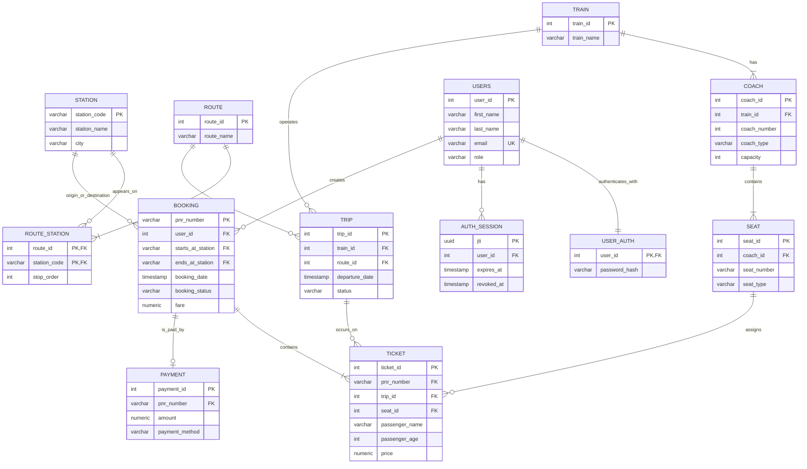

# BD Railway ERD

This ERD documents the relational model implemented in `database/schema.sql`.
`PK` denotes a primary key and `FK` denotes a foreign key. `user_auth` and
`auth_session` are deliberate additive authentication tables: the original
`users` entity has no password or session fields.

## Key business constraints

- A route station’s `stop_order` determines which station precedes another on
  a route.
- A coach number is unique within a train; a seat number is unique within a
  coach.
- A booking has a unique PNR and belongs to exactly one user.
- A ticket joins a booking, a trip, and a physical seat.
- An authentication session belongs to one user and can be revoked at logout.
